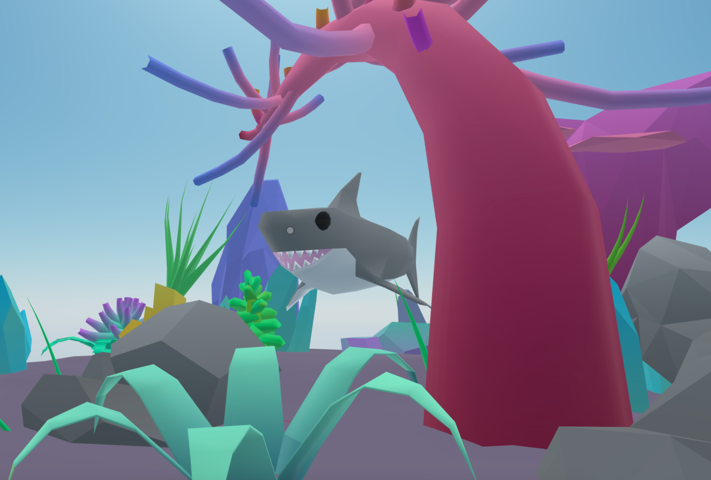

## Swimming shark

A scene that shows a shark moving around in circles along a curved circular path, using lerp over each segment of the path.

The path is generated by specifying just four points through which the shark needs to pass, the rest of the points are calculated automatically.

The shark also rotates smoothly with a spherical lerp function. It's speed also depends on the steepness of the segment it's swimming up. The speed and intensity of the swimming animation also depends on this.



[Explore the scene](https://swimming-shark-fnbuyslcqi.now.sh): this link takes you to a copy of the scene deployed to a remote server where you can interact with it just as if you were running `dcl start` locally.

**Install the CLI**

Download and install the Decentraland CLI by running the following command

```bash
npm i -g decentraland
```

For a more details, follow the steps in the [Installation guide](https://docs.decentraland.org/documentation/installation-guide/).


**Previewing the scene**

Once you've installed the CLI, download this example and navigate to its directory from your terminal or command prompt.

_from the scene directory:_

```
$:  dcl start
```

Any dependencies are installed and then the CLI will open the scene in a new browser tab automatically.

**Usage**

The shark moves following a fixed path. Its speed depends on the steepness of the section it's swimming through.

Learn more about how to build your own scenes in our [documentation](https://docs.decentraland.org/) site.

## Copyright info

This scene is protected with a standard Apache 2 licence. See the terms and conditions in the [LICENSE](/LICENSE) file.